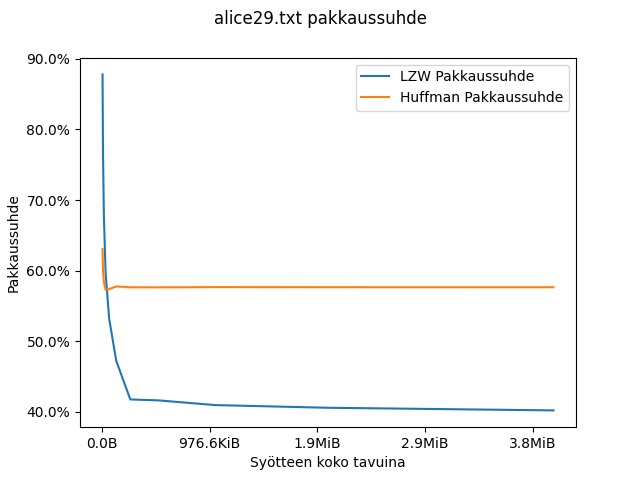
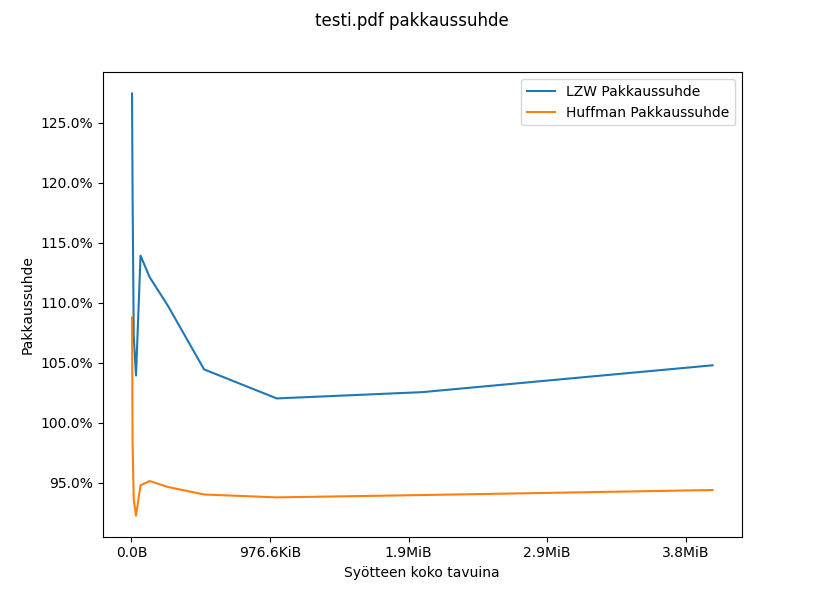

# Testausdokumentti

Ohjelman testaus on toteutettu Pythonin omalla unittest-moduulilla. Tyyppitarkastukseen käytetään pakettia mypy ja koodin laadun tarkkailemiseen työkalua pylint, vaikkakin kaikki koodi on jo formatoitu blackilla.

## Yksikkötestit

Yksikkötestit voidaan suorittaa komennolla `python -m unittest`. Testikattavuus saadann komennolla `pytest --cov-report term-missing --cov=pakkaus tests/`, laadun tarkastus komennolla `pylint pakkaus` ja tyyppitarkastus komennolla `mypy -m pakkaus`.

Projektissa on seuraavat Huffman testit:

1. test_huffman.test_printing

   - Testaa Huffmanin puun tietorakenteen tulostamista.

2. test_huffman.test_pack_data

   - Testaa tiedon pakkaamista yksimerkkisellä syötteellä, yksinkertaisella pakatulla syötteellä, ja uudestaan suuremmalla syötteellä. Testaa virhettä tyhjällä syötteellä. Vertailee oletettua ja tuloksena saatua dataa.

3. test_huffman.test_unpack_data

   - Testaa tiedon purkamista yksimerkkisellä syötteellä, yksinkertaisella pakatulla syötteellä, ja uudestaan suuremmalla syötteellä. Testaa virhettä tyhjällä syötteellä. Vertailee tuloksina saatuja merkkijonoja.

4. test_huffman.test_pack

   - Testaa sanakirjan ja datan pakkaamista.

5. test_huffman.test_unpack

   - Testaa pakatun sanakirjan ja datan purkamista.

6. test_huffman.test_packing_files

   - Testaa tiedoston pakkaamista ja purkamista. Varmistaa, että alkuperäinen tiedosto ja lopputulos ovat sama. Varmistaa myös, että virheiden ilmoittaminen toimii tiedostojen kanssa.

Ja seuraavat LZW testit:

1. test_lzw.test_compress

   - Testaa tiedon pakkaamista yksimerkkisellä syötteellä, yksinkertaisella pakatulla syötteellä, ja uudestaan suuremmalla syötteellä. Testaa virhettä tyhjällä syötteellä. Vertailee oletettua ja tuloksena saatua dataa.

2. test_lzw.test_uncompress

   - Testaa tiedon purkamista yksimerkkisellä syötteellä, yksinkertaisella pakatulla syötteellä, ja uudestaan suuremmalla syötteellä. Testaa virhettä tyhjällä syötteellä. Vertailee tuloksina saatuja merkkijonoja.

3. test_lzw.test_compressing_files

   - Testaa suuren tiedoston pakkausta ja purkamista. Varmistaa, että alkuperäinen tiedosto ja lopputulos ovat sama. Varmistaa myös, että virheiden ilmoittaminen toimii tiedostojen kanssa.

### Testikattavuus

Pytest-cov komennosta saatu testikattavuus

```
platform win32 -- Python 3.10.0, pytest-6.2.5, py-1.10.0, pluggy-1.0.0
rootdir: C:\Users\Turtvaiz\Desktop\pakkaus-tira
plugins: cov-3.0.0
collected 9 items

tests\test_huffman.py ......                                        [ 66%]
tests\test_lzw.py ...                                               [100%]

---------- coverage: platform win32, python 3.10.0-final-0 -----------
Name                  Stmts   Miss  Cover   Missing
---------------------------------------------------
pakkaus\__init__.py       3      0   100%
pakkaus\__main__.py      47     47     0%   2-71
pakkaus\huffman.py      128      0   100%
pakkaus\lzw.py           81      0   100%
---------------------------------------------------
TOTAL                   259     47    82%
```

### Nopeus- ja tehokkuustestaus

Testitiedostoina ovat [enwik8](https://cs.fit.edu/~mmahoney/compression/textdata.html), mikä on vuodelta 2006 Wikipedian varmuuskopiosta ensimmäiset 100 MB. Toisena tiedostona on [alice29.txt](https://cs.fit.edu/~mmahoney/compression/textdata.html) konkatenoituna monta kertaa peräkkäin. Alkuperäinen alice29 on noin 152 kilotavua, joten tiedostossa on paljon toistuvaa tietoa. Kolmantena esimerkkinä on oma .pdf tiedosto, jotta vertailussa ei ole vain tekstitiedostoja, ja oman testauksen mukaan sen tulokset ovat samankaltaiset kuin esimerkiksi kuvilla ja muilla valmiiksi pakatuilla tiedostoilla.

#### enwik8

Testauksesta huomataan, että molemmaat algoritmit vievät O(n) aikaa syötteen suhteen. Tämänkaltainen kuvaaja oli tulos jokaiselle tiedostolle, jota kokeilin. Kiinnostavasti huomataan, että Huffmanin koodauksen pakkaus on nopeaa, mutta purkaminen hidasta, ja LZW taas on päinvastoin. Ero on luultavasti näin huomattava vain, koska Pythonissa yksinkertaiset operaatiot ovat yllättävän paljon aikaa vieviä.

Kuvaaja (ja kaikki muut kuvaajat) saatin ottamalla tiedosto, ja prosessoimalla sen alusta yhä suurempia paloja. Esimerkiksi alussa ensimmäiset 4 kilotavua pakataan ja puretaan, sitten kaksi kertaa enemmän eli ensimmäiset 8 kilotavua ja niin edelleen.


Pakkaussuhde on molemmilla, kunhan dataa on tarpeeksi pakattavana.


Kun kuvaajaa suurennetaan, huomataan miksi. LZW tarvitsee suhteellisen paljon dataa ennen kuin sen pakkausuhde on optimaalinen. Ja eri kohdat pakkautuvat eri suhteilla, sillä sanakirja tyhjennetään useasti.

Huffmanin koodaus alkaa toimimaan nopeasti, sillä tiedostossa on käytössä vain pieni määrä eri merkkejä, sillä kyseessä on XML-tiedosto. Kun data on jo monta sivua, merkkien frekvenssit ovat siis suhteellisen tasaisia.


#### alice29.txt

Kyseessä on siis monta kertaa toistuva kirja tekstitiedostona, eli toistuvaa dataa on paljon, mutta toistuva pala on erittäin suuri. LZW ei ole algoritmi, joka voi löytää tämän palan, mutta se kuitenkin pakkaa englannin kieltä erittäin tehokkaasti. Esimerkiksi moderni algoritmi, kuten Zstd pystyy löytämään tämän toistuvan kirjan ja pakkaa tiedoston noin 60 kilotavuun.

Huffmanin koodaus on lähes koko ajan yhtä tehokas, sillä merkkejä on rajoitettu määrä ja niiden frekvenssit pysyvät samanlaisina.



#### pdf-tiedosto

Lopuksi testissä on pdf-tiedosto, mikä esittää jo valmiiksi pakattua tiedostoa. Tämänkaltainen tiedosto ei taida pakata hyvin juuri millään pakkausalgoritmilla, mutta tässä huomataan, että koska LZW ei tunnista huonosti pakkautuvaa tietoa ja jätä sitä pakkaamatta, se laajentaa sitä.

Huffmanin koodaus pakkaa tiedoston huonosti, mutta koska eri tavuja on rajoitettu määrä, se voi silti pakata sen, kunhan dataa on tarpeeksi, jolloin tallennettu sanakirja ei vie liikaa tilaa suhteessa pakattuun tietoon.


